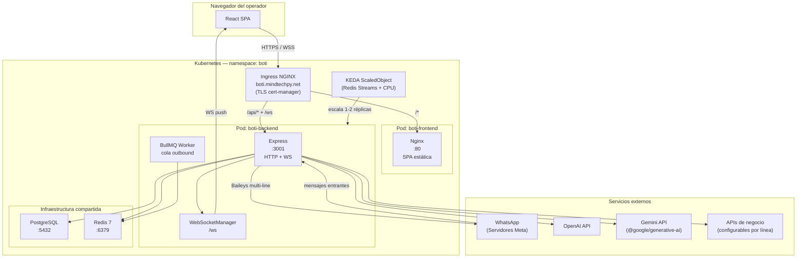
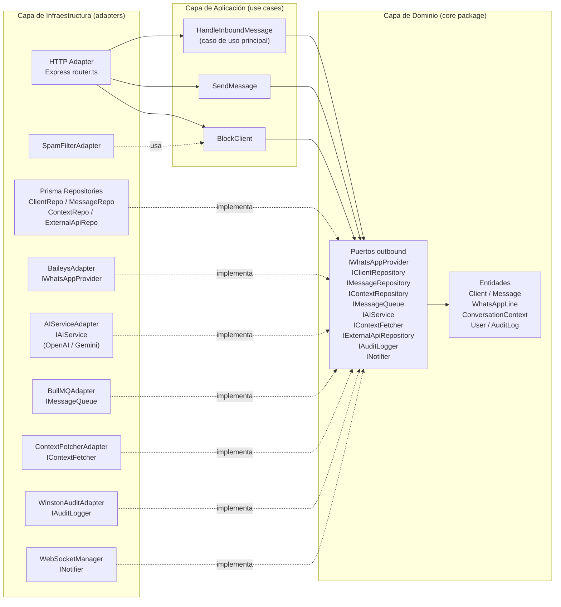
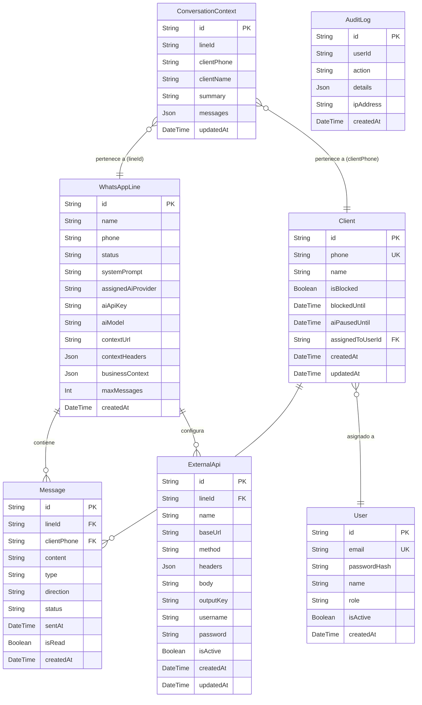
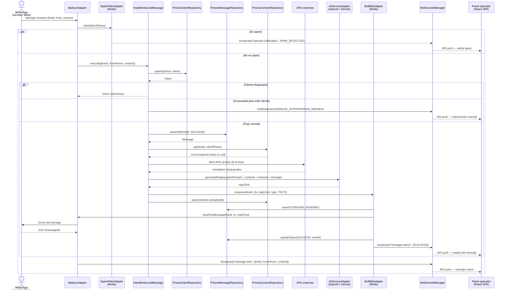
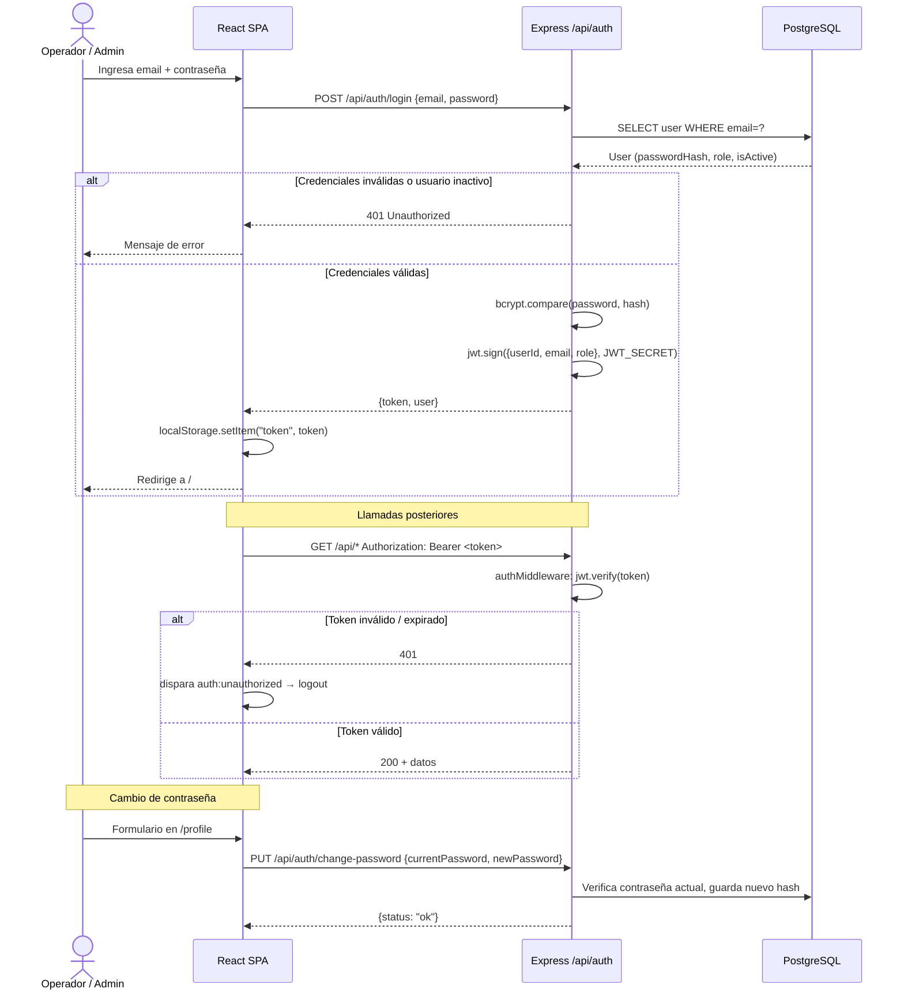
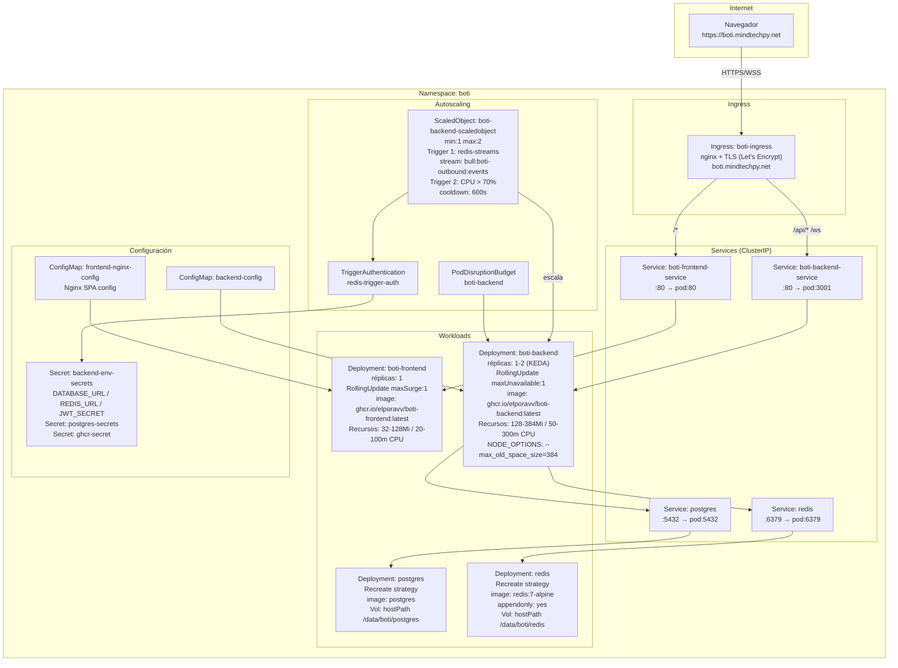

# Arquitectura de Boti

> Documentación técnica generada el 2026-04-23. Refleja el estado actual del código en `main`.

---

## 1. Overview

**Boti** es una plataforma de atención al cliente automatizada basada en WhatsApp. Permite a las empresas conectar múltiples líneas de WhatsApp, configurar un asistente de IA por línea (OpenAI o Gemini), gestionar conversaciones en tiempo real desde un panel web, e integrar APIs externas para enriquecer el contexto del bot.

### Stack principal

| Capa | Tecnología |
|------|-----------|
| Frontend | React 18 + Vite + Tailwind CSS, servido con Nginx |
| Backend | Node.js + Express 4 + TypeScript, arquitectura hexagonal |
| Base de datos | PostgreSQL via Prisma ORM |
| Cola de mensajes | BullMQ sobre Redis 7 |
| WhatsApp | @whiskeysockets/baileys (multi-line) |
| IA | OpenAI SDK + @google/generative-ai (seleccionable por línea) |
| WebSockets | ws (servidor nativo sobre HTTP) |
| Infraestructura | Kubernetes (namespace `boti`) + KEDA autoscaler |
| CI/CD | GitHub Actions → GHCR → kubectl (self-hosted runner) |

---

## 2. Diagrama de Arquitectura General

---

## 3. Arquitectura Hexagonal (Backend)

El backend sigue estrictamente la arquitectura hexagonal: el dominio (core) no depende de ningún framework ni infraestructura. Las dependencias apuntan siempre hacia adentro.

---

## 4. Diagrama de Base de Datos

Modelos Prisma sobre PostgreSQL. Todos los IDs son UUID.

Valores de enumeración (almacenados como `String`):

| Campo | Valores posibles |
|-------|-----------------|
| `Message.type` | `TEXT`, `IMAGE`, `PDF`, `LINK` |
| `Message.direction` | `INBOUND`, `OUTBOUND` |
| `Message.status` | `PENDING`, `SUCCESS`, `FAILED` |
| `WhatsAppLine.status` | `CONNECTED`, `DISCONNECTED`, `CONNECTING`, `QR_PENDING` |
| `User.role` | `ADMIN`, `OPERATOR` |
| `ExternalApi.method` | `GET`, `POST`, `PUT`, `PATCH`, `DELETE` |

---

## 5. Flujo de Mensaje Entrante

Recorrido completo desde que WhatsApp recibe un mensaje hasta que el bot responde.

---

## 6. Flujo de Autenticación

---

## 7. Infraestructura K8s

Todo bajo el namespace `boti` en un clúster Kubernetes con NGINX Ingress y cert-manager.

---

## 8. CI/CD Pipeline

Pipeline en GitHub Actions (`.github/workflows/deploy.yml`), disparado en cada push a `main`. Usa un runner self-hosted con acceso a `kubectl`.

```mermaid
graph LR
  subgraph Trigger
    Push["push → main"]
  end

  subgraph Job1["detect-changes"]
    DC["dorny/paths-filter\noutputs:\n  backend: true/false\n  frontend: true/false"]
  end

  subgraph Job2["build-backend\n(solo si cambió backend/packages/k8s)"]
    BB1["docker/setup-buildx"]
    BB2["Login GHCR\n(GHCR_PAT)"]
    BB3["Build & Push\nghcr.io/.../boti-backend\n:sha-XXXXXXX\n:latest\nplatforms: linux/amd64\ncache: GHA"]
  end

  subgraph Job3["build-frontend\n(solo si cambió frontend/k8s)"]
    BF1["docker/setup-buildx"]
    BF2["Login GHCR"]
    BF3["Build & Push\nghcr.io/.../boti-frontend\n:sha-XXXXXXX\n:latest\nplatforms: linux/amd64\ncache: GHA"]
  end

  subgraph Job4["deploy-infra\n(siempre, idempotente)"]
    DI1["kubectl apply namespace"]
    DI2["Crear/actualizar Secrets\n(ghcr-secret, backend-env-secrets\npostgres-secrets)"]
    DI3["kubectl apply postgres.yaml\nwait --timeout=180s"]
    DI4["kubectl apply redis.yaml\nwait --timeout=120s"]
    DI5["kubectl apply configmap.yaml"]
    DI6["kubectl apply ingress.yaml"]
  end

  subgraph Job5["deploy-backend\n(solo si backend cambió + infra OK)"]
    DB1["Pausar KEDA ScaledObject"]
    DB2["kubectl apply backend-deployment + pdb"]
    DB3["kubectl set image :sha-XXXXXXX"]
    DB4["kubectl rollout status --timeout=600s"]
    DB5["Reanudar KEDA ScaledObject"]
    DB6["Health check\ncurl /api/health ×10"]
  end

  subgraph Job6["deploy-frontend\n(solo si frontend cambió + infra OK)"]
    DF1["kubectl apply frontend-deployment"]
    DF2["kubectl set image :sha-XXXXXXX"]
    DF3["kubectl rollout status --timeout=300s"]
  end

  subgraph Job7["summary\n(siempre)"]
    S1["Imprime estado de pods\nservices, ingress"]
  end

  Push --> DC
  DC -->|backend=true| BB1 --> BB2 --> BB3
  DC -->|frontend=true| BF1 --> BF2 --> BF3
  BB3 --> DI1
  BF3 --> DI1
  DI1 --> DI2 --> DI3 --> DI4 --> DI5 --> DI6
  DI6 -->|backend changed| DB1 --> DB2 --> DB3 --> DB4 --> DB5 --> DB6
  DI6 -->|frontend changed| DF1 --> DF2 --> DF3
  DB6 --> S1
  DF3 --> S1
```

---

## 9. Endpoints HTTP (tabla completa)

Todos los endpoints se montan bajo el prefijo `/api`. Los marcados con **JWT** requieren header `Authorization: Bearer <token>`.

| Método | Ruta | Auth | Descripción |
|--------|------|------|-------------|
| `GET` | `/` | No | Health check raíz — retorna `{status, timestamp}` |
| `POST` | `/api/auth/login` | No | Login con email/contraseña — retorna `{token, user}` |
| `GET` | `/api/auth/me` | JWT | Retorna el payload del token del usuario actual |
| `PUT` | `/api/auth/change-password` | JWT | Cambia la contraseña del usuario autenticado |
| `GET` | `/api/health` | No | Health check — retorna `{status: "ok", ts}` |
| `GET` | `/api/stats` | JWT | Estadísticas globales: mensajes totales, líneas activas, leads, tráfico por hora |
| `GET` | `/api/lines` | JWT | Lista todas las líneas WhatsApp con estado y QR code |
| `POST` | `/api/lines/:lineId/connect` | JWT | Conecta (o reconecta) una línea WhatsApp — inicia flujo QR |
| `POST` | `/api/lines/:lineId/disconnect` | JWT | Desconecta una línea WhatsApp |
| `DELETE` | `/api/lines/:lineId` | JWT | Desconecta y elimina una línea de la BD |
| `GET` | `/api/lines/:lineId/status` | JWT | Estado actual y QR code de una línea |
| `GET` | `/api/lines/:lineId/config` | JWT | Configuración de IA de la línea (systemPrompt, provider, apiKey, model) |
| `PUT` | `/api/lines/:lineId/config` | JWT | Actualiza configuración de IA de la línea |
| `GET` | `/api/lines/:lineId/context` | JWT | Obtiene contexto de negocio y systemPrompt de la línea |
| `PUT` | `/api/lines/:lineId/context` | JWT | Actualiza contexto de negocio y systemPrompt |
| `GET` | `/api/lines/:lineId/external-apis` | JWT | Lista las APIs externas configuradas para la línea |
| `POST` | `/api/lines/:lineId/external-apis` | JWT | Crea una nueva API externa para la línea |
| `PUT` | `/api/lines/:lineId/external-apis/:apiId` | JWT | Actualiza una API externa existente |
| `DELETE` | `/api/lines/:lineId/external-apis/:apiId` | JWT | Elimina una API externa |
| `POST` | `/api/lines/:lineId/external-apis/:apiId/test` | JWT | Prueba en vivo una API externa y retorna la respuesta |
| `GET` | `/api/audit-logs` | JWT | Últimos 50 registros de auditoría ordenados por fecha desc |
| `POST` | `/api/messages/send` | JWT | Encola un mensaje saliente manual `{lineId, to, content, type, mediaPath}` |
| `GET` | `/api/messages/unread-count` | JWT | Conteo total de mensajes entrantes no leídos |
| `GET` | `/api/messages/:phone` | JWT | Historial de mensajes de un cliente (paginado por cursor: `?limit=30&before=<id>`) |
| `POST` | `/api/messages/:phone/read` | JWT | Marca todos los mensajes entrantes del cliente como leídos |
| `GET` | `/api/chats` | JWT | Lista de chats activos con último mensaje, asignación, y conteo de no leídos |
| `POST` | `/api/clients/:phone/pause` | JWT | Pausa la IA para el cliente durante N horas `{hours}` |
| `POST` | `/api/clients/:phone/assign` | JWT | Asigna (o desasigna) un agente a un cliente `{agentId}` |
| `PUT` | `/api/clients/:phone` | JWT | Actualiza el nombre del cliente |
| `GET` | `/api/agents` | JWT | Lista todos los agentes activos `{id, name, role}` |

---

## 10. Eventos WebSocket

El servidor expone un WebSocket en `/ws`. El cliente envía `{event: "ping"}` cada 30 segundos como heartbeat. El servidor hace broadcast a todos los clientes conectados.

| Evento | Dirección | Payload | Cuándo se emite |
|--------|-----------|---------|-----------------|
| `line:status` | Server → Client | `{lineId, status, qrCode}` | La línea Baileys cambia de estado (CONNECTING, QR_PENDING, CONNECTED, DISCONNECTED) |
| `message:new` | Server → Client | `{lineId, fromPhone, clientPhone, fromName, content, type}` | Llega un mensaje entrante no spam |
| `message:status` | Server → Client | `{messageId, status, sentAt}` | El worker BullMQ procesa un mensaje saliente (SUCCESS o FAILED) |
| `operator:notification` | Server → Client | `{lineId, event, details}` | Eventos de sistema: `SPAM_DETECTED`, `AI_ERROR`, `MANUAL_INTERVENTION_NEEDED`, `NEW_MESSAGE` |

El frontend suscribe todos los eventos vía `window.dispatchEvent(new CustomEvent('boti:ws-event', {detail: data}))` y los componentes escuchan `boti:ws-event`.

---

## 11. Stack tecnológico

| Capa | Tecnología | Versión | Propósito |
|------|-----------|---------|-----------|
| Frontend | React | 18.3.1 | UI declarativa con hooks |
| Frontend | Vite | 5.4.2 | Build tool y dev server |
| Frontend | Tailwind CSS | 3.4.10 | Estilos utility-first |
| Frontend | React Router DOM | 6.26.1 | Enrutamiento SPA |
| Frontend | TypeScript | 5.5.4 | Tipado estático |
| Frontend | Nginx | alpine | Servidor de archivos estáticos en contenedor |
| Backend | Node.js + Express | 4.19.2 | Servidor HTTP REST + WebSocket |
| Backend | TypeScript | 5.5.4 | Tipado estático |
| Backend | Prisma ORM | 5.16.0 | Acceso a BD tipado, migraciones |
| Backend | ws | 8.17.1 | Servidor WebSocket nativo |
| Backend | BullMQ | 5.12.0 | Cola de mensajes sobre Redis (outbound) |
| Backend | ioredis | 5.4.1 | Cliente Redis (auth state Baileys + BullMQ) |
| Backend | @whiskeysockets/baileys | 7.0.0-rc.9 | Conexión multi-línea a WhatsApp Web |
| Backend | openai | 4.55.0 | SDK OpenAI (GPT-4o, etc.) |
| Backend | @google/generative-ai | 0.18.0 | SDK Gemini (proveedor alternativo de IA) |
| Backend | jsonwebtoken | 9.0.2 | Generación/verificación de tokens JWT |
| Backend | helmet | 7.1.0 | Headers de seguridad HTTP |
| Backend | pino | 9.3.2 | Logger estructurado JSON |
| Base de datos | PostgreSQL | latest | Almacenamiento relacional principal |
| Caché / Cola | Redis | 7-alpine | Autenticación Baileys + cola BullMQ |
| Infraestructura | Kubernetes | — | Orquestación de contenedores |
| Infraestructura | KEDA | v1alpha1 | Autoescalado basado en métricas Redis + CPU |
| Infraestructura | NGINX Ingress | — | Enrutamiento TLS, proxy HTTP/WS |
| Infraestructura | cert-manager | — | Certificados TLS automáticos (Let's Encrypt) |
| CI/CD | GitHub Actions | — | Pipeline build + deploy en self-hosted runner |
| Registro | GHCR | — | Almacenamiento de imágenes Docker |
| Monorepo | npm workspaces | — | `apps/backend`, `apps/frontend`, `packages/core` |
